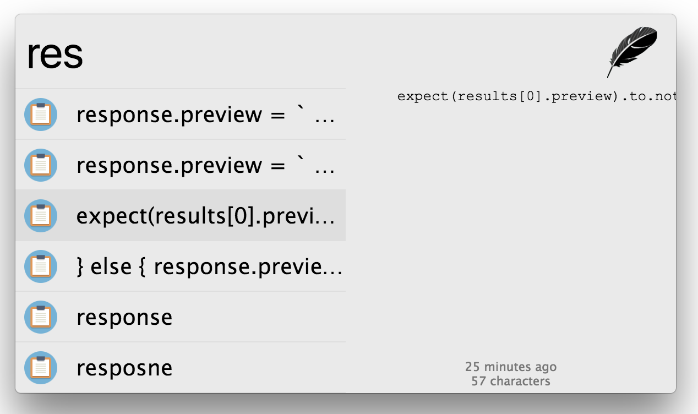
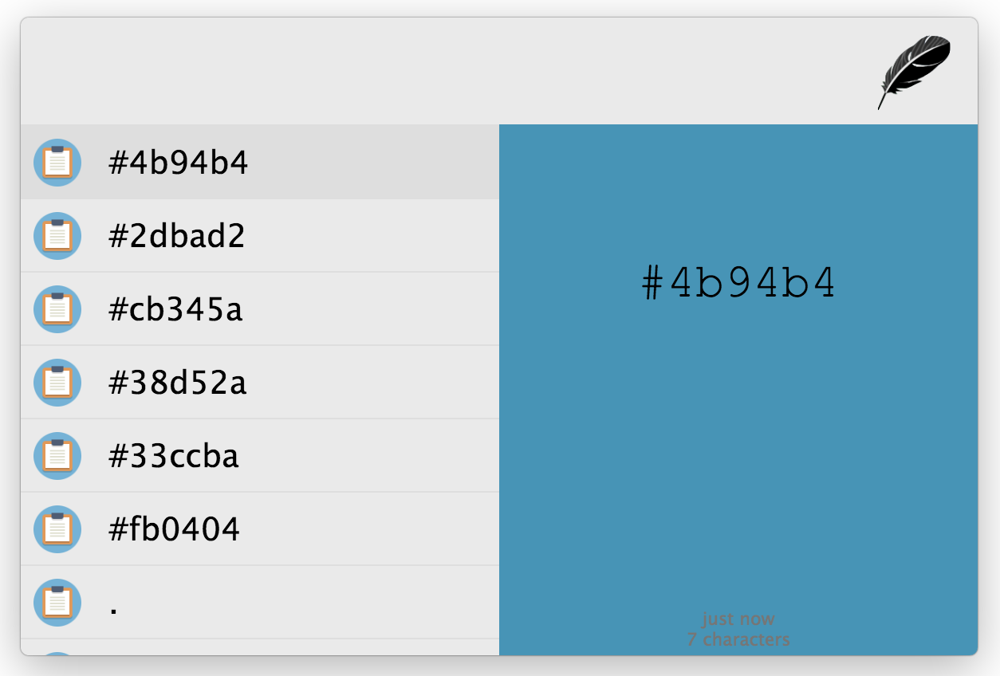

## Clipboard manager for Zazu

Remembers the things you've copied into your clipboard, and gives it back in a
searchable format.

## Usage

Most commonly this is opened with a keyboard shortcut `alt+shift+v`, which can
be overwritten. Simply hit this key and you'll immediately be shown your recent
clips that can be searched.

Without a keyboard shortcut, open Zazu and use the prefix `clip` to search
through your clips. For example if you want to search your clips for the word
emoji you can use this example:

~~~
clip emoji
~~~

## Installing

Add the package to your plugins array in `./zazurc.js`.

~~~ javascript
'tinytacoteam/zazu-clipboard',
~~~

You can overwrite the keyboard shortcut by defining a variable with the name
`ClipboardKey`.

~~~ javascript
{
  name: 'tinytacoteam/zazu-clipboard',
  variables: {
    ClipboardKey: 'cmd+shift+v',
  },
}
~~~

If you prefer to disable image storing, you can set the `ignoreImages` to
`true`.

~~~ javascript
{
  name: 'tinytacoteam/zazu-clipboard',
  variables: {
    ignoreImages: true,
  },
}
~~~

By defualt we remember the last 50 items in your clipboard. To change this add a
`size` variable to your configuration.

~~~ javascript
{
  name: 'tinytacoteam/zazu-clipboard',
  variables: {
    size: 1000,
  },
}
~~~

## Screenshots

